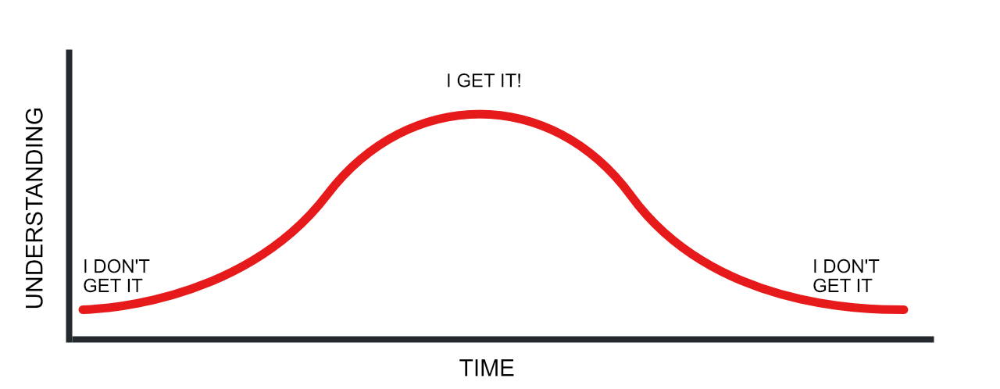

## Developer Resources

> Hello World! 👋 The introduction to this list somehow mutated into a sort of impromptu history lesson/philosophical treatise on thinking like a dev--I really don't know how the heck that happened! I was just typing away and then... **bam**! I hope it doesn't come across as preachy or prescriptive: Think of it as a naiively optimistic pep talk from one student of life to another. 👍
>
> If you're just here for the links and resources, skip down to the [links & resources](#links & resources) section. If however you enjoy long winded rambling pontification, well you can start right from the top. 😂

> *The more you know, the more you know you don't know.*  - someone ~~smart~~ **wise AF**

##### Table Of Contents

* [Look At It This Way](#Look#At#It#This#Way)
    * [Introduction](#Introduction)
    * [Philosophy](#Philosophy)
    * [Software & Setup](#Software#&#Setup)
    * [Where To Begin?](#Where#To#Begin?)
* [Links And Resources](#Links#And#Resources)
    * [Software](#Software)
    * [The Basics](#The#Basics)
    * [Text Editors](#Text#Editors)
    * [Command Line Tools](#Command#Line#Tools)
    * [The Terminal](#The#Terminal)
    * [Design](#Design)
    * [Network Tools](#Network#Tools)
    * [Local Development](#Local#Development)
    * [Things That Make A **Huge** Difference](#Things#That#Make#A#**Huge**#Difference)
    * [Browsers](#Browsers)
    * [Network Tools](#Network#Tools)
    * [Collaboration](#Collaboration)
* [Notes and Ideas](#Notes#and#Ideas)
* [Defensive Security](#Defensive#Security)
* [Techniques and Workflow](#Techniques#and#Workflow)
* [Documentation](#Documentation)
* [Cheatsheets](#Cheatsheets)
* [To be expanded](#To#be#expanded)

## Look At It This Way

### Introduction

 There are enough "getting started" how-to's, walkthroughs, tips, tricks, posts, and pages scattered around the internets to last the aspiring developer a lifetime. And a lot of them are really good. I mean really, **really** good. There are blogs like [Tania Rascia's](https://taniarascia.com), free books like [You Don't Know JS](https://youdontknowjs.com) or [Automate Everything](https://automateeverything.com), entire courses on Youtube like [Harvard's CS 50](https://youtube.com/harvard), and thriving communities of experts--often the very authors of the languages and code you've got questions about--available in IRC chats, forums, subreddits, Slack channels, and places like [StackOverflow](https://stackoverflow.com). 
 
 It's an extension of an ethos born with the first computers, carried and cultivated by a rebellious collective of proto-programmers, enshrined and canonized with the GNU project, the BSD, and the advent of FOSS, and since maintained by countless wizards of tech, both sung and unsung, scattered across the globe and connected by the internet.

So why put up another one? Well even with all that's already out there, it never hurts to add to the pile. My own humble "awesome list" was born more as a living document of resources and patterns I've collected and used over the years that I finally decided to articulate and archive for my own reference. But in the spirit of open source knowledge I thought *even if just one person stumbles across this and finds something useful, it'd be worth throwing it up on Github*. If you're that person, awesome. I hope you find something that really twizzles your dipstick and helps you on your journey.

But before we get to the tools, let's take a brief look at the ideas which shaped the community and set the standards we know of as the free and open internet.

### Philosophy

The greatest thing, historically speaking (and imho), about web/tech culture has been the willingness of brilliant people to share software, skills, stories, and resources with the rest of the community over the years. It's created a collective roadmap of how we got where we are. Really truly, without the generosity of the early generation of Unix, FOSS, BSD, GNU, and Linux folks, the world wouldn't be what it is today. They made it the norm to write incredibly valuable and useful code, then turn it over to the community as open source software--going so far as to even diligently maintain it over the years, and creating countless opportunities for others to build on it with careers in the field.

A successful career in this industry requires an elasticity of intellect and a resilience in the face of insurmountable odds. It will put you in contact with so many technologies that your head will spin--at first. While daunting, you'll find your balance and a comfortable niche in the ecosystem from which to get your bearings. From there you can continue to branch out and explore the broader landscape, a process that once begun, never ends. 

There's a set of defining characteristics that make a developer/engineer great: An insatiable curiosity, a willingness to evolve over time, a tendency toward seeing problems as inherently solvable, a humility that allows them to pair the great work they do with the great work of their team, company, or the FOSS community at large, and perhaps most importantly, a steady methodical persistence in search of elegant solutions. 

While it's entirely possible to find that comfortable niche and stick with it forever, a true jedi of the art never stops absorbing evaluating and synthesizing information, never stops reading, learning, deconstructing, reconstructing, and making--even if the work they're currently doing to pay the bills is unstimulating or repetetive. They remain always in humble respect of the vastness of available knowledge out there. They recognize that the landscape is constantly moving forward, even as it remains at it's core an assembly of 0's and 1's.

### Software & Setup

There's no "right way" to set up a development environment. You find a workflow of your own over time, with hardware and software flavors that suit your particular needs. That said, there are shortcuts and tricks that, while seemingly inconsequential individually, will dramatically improve a developers productivity in aggregate. There are certainly plenty of things I wish I'd discovered months or years earlier, and to this day I'm adding, tweaking, and experimenting with my routines.

I would encourage anyone reading this to *try all the things* at least once, or at least all the highly regarded ones with large thriving communities. If you like Javascript try Python, If you like React, experiment with Vue, Angular, or Ember. If you love Jquery, build something with nothing but VanillaJS. If you're a backend developer, try converting a Sketch file into a responsive front-end UI, and if you're a die hard CSS stylist, make sure to fire up a Digital Ocean droplet, install Ubuntu 18.04 LTS, and configure a web server from scratch.

The point is not of course to derail you from a path or curriculum, or waste precious time if you're in the middle of a project with a deadline--on the contrary, you should do those things when you have a chance and when you *want* to do them. The point is also not  -- The point is to give you a familiarity and modicum of comfort working all across the stack, so that you can better understand the needs and challenges of the people that you're working with. 

Empathy comes in many forms, and one of the reasons different camps and schools of thought become so entrenched and even develop animosity toward one another is often simply the fact that they never took the time to see it from another perspective. 

Any time you leave your comfort zone, especially as an expert, and try something that you're unfamiliar with, you increase the breadth of your understanding, your empathy for the position those around you are in, and your humility: There's nothing quite like the feeling of being a newb to bring a high and mighty expert mentality back down to Earth.

This also allows the expert to treat the junior devs in their organization with much more respect. Feeling out of your element is uncomfortable, and it feels great when a mentor or trainer recognizes that, and makes you feel like you're allowed some wiggle room as you figure things out.

### Where To Begin?

Most of us who work in tech related fields were drawn to computers for as long as we can remember. We're a generation that was raised on the internet, and screens are as intuitive and natural to us as TV. But if you're anything like me, a lifetime of being the "resident computer expert" in my family and communities didn't neccassarily translate to a clear understanding of what I wanted to *do* with them. 

At first I worked exclusively with GUI programs on tangentially technological projects. Then a business I was consulting for needed some changes made to their website and I had to open a text editor for the first time since high school. I was immediately hooked.

Next I went through an in house IT phase, working with networks, hardware, and resolving trivial problems for execs while putting out fires for management. That introduced me to the command line and Linux, and by then I was really cooking with gas.

But I've always been an artist and a musician--aesthetics are not only important to me, they often define my experience. The subtleties of color, typography, shape, size, and alignment, are intuitive to me, and it gives me pleasure both to look at and create beautiful things.

That's when I took my first job in web development and apart from a brief stint as an executive at a startup in San Francisco, I haven't looked back.

## Links & Resources

#### The Basics

- [MacOS]()
- [Homebrew]()
- [NPM]()

#### Text Editors

- [Visual Studio Code](https://code.visualstudio.com) 
- [Atom](https://atom.io) 
- [Sublime Text](https://sublimetext.com)
- [Brackets]()
- [Xcode]()

## Command Line Tools

#### The Terminal

- [ZSH](https://)
- [Oh My Zsh](https://)
- [Iterm2](https://iterms2.com)
- [Hyper](https://hyper.com)
- [Awesome Command Line](https://github.com/)

## Software

#### Design

- [Sketch]()
- [Affinity Designer]()
- [Affinity Photo]()
- [Adobe Creative Cloud 6]()
- [Zeplin]()
- [Sip]()
- [Image Optim]()
- [Squash]()
- [Image2Icon]()
- [Figma](https://www.figma.com)

## Local Development

#### Network Tools

- [MAMP]()
- [Virtualbox]()
- [Vagrant]()
- [Yummy FTP]()
- [Sequel Pro]()
- [Postman]()
- [Insomnia]()
- [MySQL]()
- [MongoDB]()

#### Browsers

- [Chrome]()
- [Firefox]()
- [Firefox Developer Edition]()
- [Brave]()
- [Opera]()
- [Safari]()

#### Things That Make A **Huge** Difference

- [Flux]()
- [Spectacle]()
- [Alfred]()
- [1Password]()
- [iStat Menus]()
- [Cheatsheet]()
- [Setapp]()
- [Dash]()

#### Collaboration

- [Dropbox]()
- [Onedrive]()
- [Slack]()
- [Telegram]()
- [Signal]()

#### Notes and Ideas

- [Evernote]()
- [Joplin]()
- [Workflowy]()
- [Trello]()
- [Todoist]()
- [Google Keep]()
- [Scrivener]()
- [Scapple]()

#### Defensive Security

- [Wireshark]()
- [Sloth]()
- [Burp Pro]()
- [Little Snitch]()
- [Micro Snitch]()

## Techniques and Workflow

- Learn to use the keyboard shortcuts.
- Show hidden files and folders.
- Most things that can be done with the command line, should be done with the command line.
- Organize your User/ folder in an intuitive way. The [ten point]() method is good, but there are others.

## Documentation

- [Mozilla Developer Network](https://developer.mozilla.org/en-US) - The ultimate front-end resources for developers, by developers.
- [PHP Manual](https://secure.php.net/manual/en) - The official documentation manual for the core PHP framework and language.
- [Basic MySQL](http://mysqltutorial.org/basic-mysql-tutorial.aspx) - This basic MySQL tutorial explains some of the basic SQL statements.
- [C# Guide](https://docs.microsoft.com/en-us/dotnet/csharp) - The C# guide provides many resources about the C# language. 
- [DevDocs](https://devdocs.io) - This service combines multiple API documentations in a fast, organized, and searchable interface.

## Cheatsheets

- [HTML Reference](https://htmlreference.io) - A free guide to HTML which features all elements and attributes.
- [CSS Reference](https://cssreference.io) - A free visual guide to CSS which features the most popular properties.
- [How HTTPS Works](https://howhttps.works) - A guide to how HTTPS works ...in a comic!
- [How DNS Works](https://howdns.works) - A fun and colorful explanation of how DNS works.
- [HTTP Status Codes](https://httpstatuses.com) - An easy to reference database of HTTP Status Codes with their definitions.
- [Devhints](https://devhints.io) - A ridiculous collection of web development cheatsheets.
- [TLDR](https://tldr.ostera.io) - A community effort to simplify the beloved man pages with practical examples.

## Awesome lists and resources

- [Awesome list of awesome lists](https://github.com/sindresorhus/awesome)
- [Awesome Python](https://github.com/vinta/awesome-python)
- [Every programmer should know](https://github.com/mtdvio/every-programmer-should-know)
- [Papers we love](https://github.com/papers-we-love/papers-we-love)
- [Interviews](https://github.com/kdn251/interviews)
- [Tech interview handbook](https://github.com/yangshun/tech-interview-handbook)
- [Awesome React](https://github.com/enaqx/awesome-react)
- [Awesome React component](https://github.com/brillout/awesome-react-components)
- [Awesome Mac](https://github.com/jaywcjlove/awesome-mac)
- [Frontend dev bookmarks](https://github.com/dypsilon/frontend-dev-bookmarks)
- [Free for dev software](https://github.com/ripienaar/free-for-dev)
- [Awesome PHP](https://github.com/ziadoz/awesome-php)
- [Awesome MacOS command line](https://github.com/herrbischoff/awesome-macos-command-line)
- [Awesome sysadmin](https://github.com/kahun/awesome-sysadmin)
- [Modern JS cheatsheet](https://github.com/mbeaudru/modern-js-cheatsheet)
- [The book of secret knowledge](https://github.com/trimstray/the-book-of-secret-knowledge)
- [Awesome shell](https://github.com/alebcay/awesome-shell)
- [My MacOS](https://github.com/nikitavoloboev/my-mac-os)
- [Awesome VSCode](https://github.com/viatsko/awesome-vscode)
- [WTFPython](https://github.com/satwikkansal/wtfpython)
- [WTF JS](https://github.com/denysdovhan/wtfjs)
- [Awesome remote job](https://github.com/lukasz-madon/awesome-remote-job)
- [CSS Protips](https://github.com/AllThingsSmitty/css-protips)
- [Professional programming](https://github.com/charlax/professional-programming)
- [Public API's](https://github.com/n0shake/Public-APIs)
- [Front end guide](https://github.com/grab/front-end-guide)
- [React developer roadmap](https://github.com/adam-golab/react-developer-roadmap)
- [Cheatsheets AI](https://github.com/kailashahirwar/cheatsheets-ai)
- [Become fullstack](https://github.com/bmorelli25/Become-A-Full-Stack-Web-Developer)
- [Learn anything](https://github.com/learn-anything/learn-anything)
- [Pure Bash Bible](https://github.com/dylanaraps/pure-bash-bible)
- [React Howto](https://github.com/petehunt/react-howto)
- [Python examples](https://github.com/geekcomputers/Python)
- [Awesome podcasts](https://github.com/rShetty/awesome-podcasts)
- [How to secure a Linux server](https://github.com/imthenachoman/How-To-Secure-A-Linux-Server)
- [Awesome Hyper](https://github.com/bnb/awesome-hyper)
- [Mac CLI](https://github.com/guarinogabriel/Mac-CLI)
- [Movies for hackers](https://github.com/k4m4/movies-for-hackers)
- [Bash snippets](https://github.com/alexanderepstein/Bash-Snippets)
- [Awesome opensource](https://github.com/lk-geimfari/awesomo)
- [30 seconds of interviews](https://github.com/30-seconds/30-seconds-of-interviews)
- [Must watch Javascript](https://github.com/AllThingsSmitty/must-watch-javascript)
- [Learn Node](https://github.com/workshopper/learnyounode)
- [Mac setup](https://github.com/sb2nov/mac-setup)
- [Side project marketing](https://github.com/portable-cto/side-project-marketing)
- [Terminal Mac cheatsheet](https://github.com/0nn0/terminal-mac-cheatsheet)
- [Awesome security](https://github.com/sbilly/awesome-security)
- [Awesome app ideas](https://github.com/tastejs/awesome-app-ideas)
- [Awesome Nodejs](https://github.com/sindresorhus/awesome-nodejs)
- [Frontend resources](https://github.com/thedaviddias/Resources-Front-End-Beginner)

## To be expanded

CSS Tricks
Smashing Magazine
That Cheatsheet page
Javascript 30
Flexbox
Grid
ES6
React
Vue
PHP
Laravel
Wordpress
SQL
Cpanel
Namecheap
Digital Ocean
Linux
Ubuntu
Git
Github
Bitbucket
Invision

## License

[MotoRossi](http://motorossi.me) has waived all copyright and related or neighboring rights to this work. Happy hacking! 🦄

<!-- > One thing I've learned is that there is an important balance of humility and confidence which, if properly struck, creates an environment where personal and professional growth can symbiotically thrive. But what I also have is the unshakeable persistence to see things through, which, when all other methodologies have failed me, is what I can rely on to solve nearly any problem I come across. And that's what gives me the confidence to speak from a position of understanding and expertise. -->