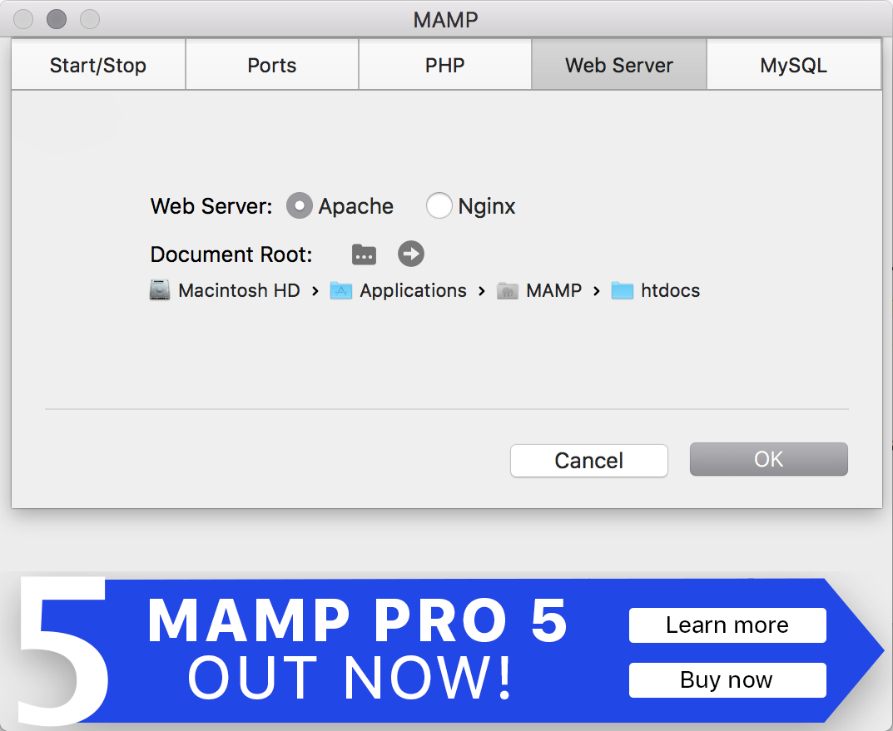
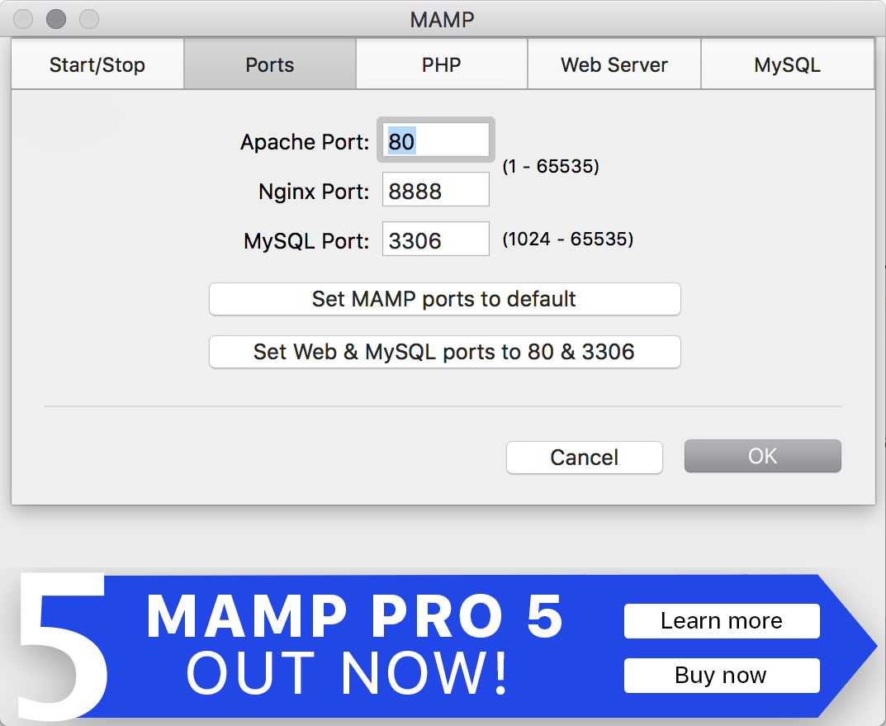

# Setting Up A Local Development Environment For Wordpress

In the world of web development, there are a dozen ways to do anything. While your workflow may ultimately be dictated by the agency you work for or the stack needed for a particular project, one thing's for certain: There are tricks and shortcuts to streamline the process, and somebody else has probably already figured them out.

I used MAMP as a local Wordpress development environment for years and I had a process that made it as streamlined and painless as possible to set up a new project. Lately I've been experimenting with a Vagrant/Virtualbox system that brings parity between my local, staging, and production environments, however I still think it's important to have MAMP on call.

This is the first of a three article series in which I will walk you through step by step the process of setting up and streamlining a local development environment. In the second article I'll walk you through setting up Wordpress itself, and in the third I'll show you a more advanced and wholly different paradigm for Wordpress development.

But let's not get ahead of ourselves! One beer at a time as they say ;)

## The MAMP way

MAMP stands for MacOS, Apache, MySQL, and PHP. It makes it easy to spin up a local web server and MySQL database. Although it's incredibly easy to use and ready to go out of the box, a little bit of extra configuration up front can make it even *more* easy and convenient over time. Let's begin.

### Get Wordpress

Before we begin, open a terminal session and make a new directory for your Wordpress project.
```
$ cd path/to/directory && mkdir newsite && cd newsite
```

go to Wordpress.org, grab a copy of the latest stable release (5.1.1 at the time of writing), and unzip it in your new directory. 

If you haven't already, download and install MAMP.

Open MAMP and make sure the document root is **Applications > MAMP > htdocs**. That's the default, but might as well be certain. You can **CMD + Q** MAMP for now while we set the rest up. 



### Allow virtual hosts

Go to 
```
Applications >  MAMP > conf > Apache > httpd.conf 
```
and open that file with your text editor.

Hit CMD + f and find this line:
```
# Virtual hosts
#Include /Applications/MAMP/conf/apache/extra/httpd-vhosts.conf
```
Uncomment the line so it looks like this:
```
# Virtual hosts
Include /Applications/MAMP/conf/apache/extra/httpd-vhosts.conf
```

### Allow Symlink override

In the same file find the line that looks like this:
```
<Directory />
    Options Indexes FollowSymLinks
    AllowOverride None
</Directory>
```
And change **none** to **all**.
```
<Directory />
    Options Indexes FollowSymLinks
    AllowOverride All
</Directory>
```

### Change the listening port

Once again in the same file look for these two lines (they won't be right next to one another):

```
listen 8888
ServerName localhost:8888
```

And change them to this:

```
listen 80
ServerName localhost:80
```

Then save the file.

### Add the virtual host path

Navigate to **Applications > MAMP > conf > apache > extra** and open the **httpd-vhosts.conf** file in your text editor.

At the end of the document add this:

```
<VirtualHost *:80>
  ServerName newsite.test
  DocumentRoot "/path/to/directory"
</VirtualHost>
```

Where ServerName is the name of your new site and DocumentRoot is the directory that your new Wordpress project will be located.

Save the file.

### Allow your computer to recognize the domain

Finally, we need to make the computer recognize the new domain we've created.

Open your terminal and type:

```
sudo pico /etc/hosts
```

After entering your password you'll be editing a text file with Nano that looks like this.

```
##
# Host Database
#
# localhost is used to configure the loopback interface
# when the system is booting.  Do not change this entry.
##
127.0.0.1       localhost
255.255.255.255 broadcasthost
::1             localhost
fe80::1%lo0     localhost

127.0.0.1       newsite.test
```

Press down until you get to the end of the file and add the line:

```
127.0.0.1       newsite.test
```

Then press ctrl + o to finish editing, enter to save the changes, and ctrl + x to exit back to your terminal screen.

### Change MAMP ports 

Open MAMP and navigate to **preferences > ports**. Change the ports to 80, 8888, and 3306.



Exit out of MAMP. When you restart the server all of your changes will take effect.

Once you setup your Wordpress installation you'll be able to navigate to newsite.test in your browser to see it! If you want a little instant gratification (or if you want to make sure you did everything right) just go to the directory you set up and create a file with some html in it and name it **index.php**. After restarting MAMP you should be able to see the file at newsite.test!

### Rinse and repeat

The beauty of this setup is that you can repeat it for as many sites as you'd like. Just follow the last couple steps and add a new virtual host at the bottom of the vhosts.conf file with it's own ServerName and DocumentRoot:

```
<VirtualHost *:80>
  ServerName newsite.test
  DocumentRoot "path/to/newsite"
</VirtualHost>

<VirtualHost *:80>
  ServerName anothernewsite.test
  DocumentRoot "path/to/anothernewsite"
</VirtualHost>
```

And allow your computer to recognize it using the same process in your terminal:

```
sudo pico /etc/hosts
```

Now we can get down to the business of setting up Wordpress!
